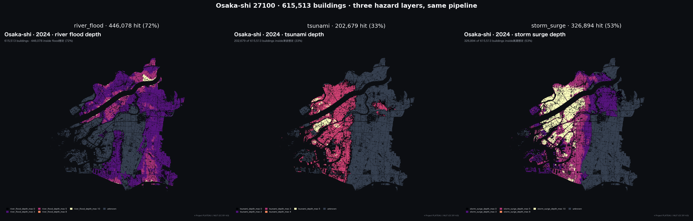
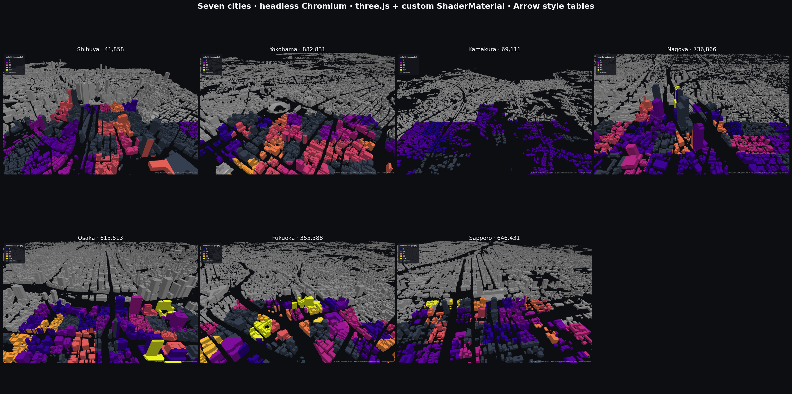
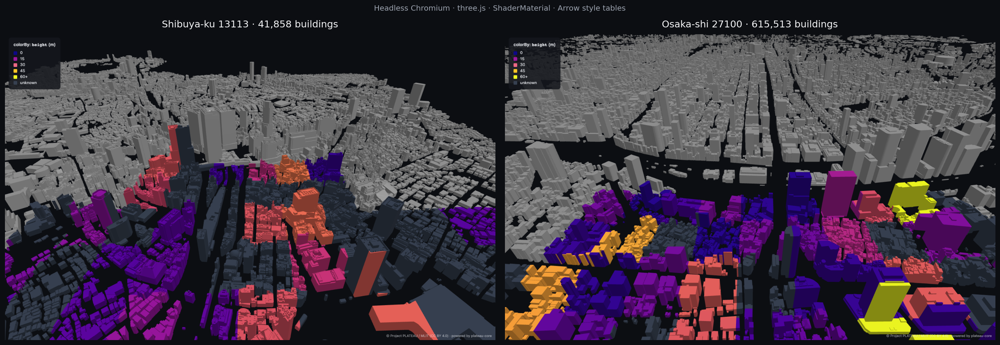
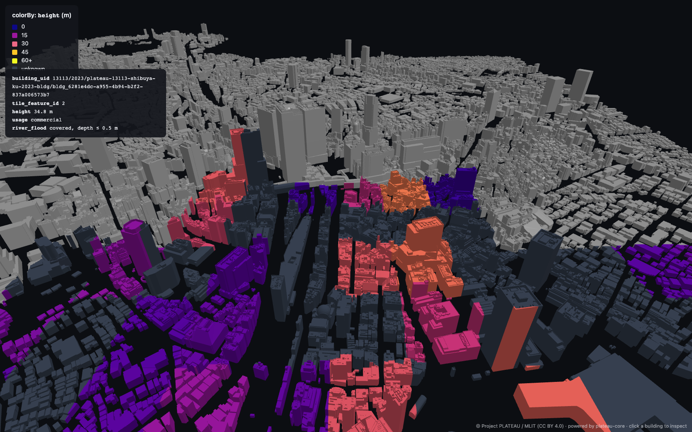

<div align="center">

<a href="https://yodolabs.jp">
  <picture>
    <source media="(prefers-color-scheme: dark)" srcset="docs/yodolabs-logo-dark.svg">
    
  </picture>
</a>

# plateau-parquet

**[Project PLATEAU](https://www.mlit.go.jp/plateau/) のための、信頼性の高い建物データ整備＋ハザード重畳パイプライン。**

日本の3D都市モデルを、SQL と空間解析にそのまま使える単一の `buildings.parquet` に変換します。

*[Yodo Labs](https://yodolabs.jp) によるオープンソースプロジェクト · 連絡先: [pan@yodolabs.jp](mailto:pan@yodolabs.jp)*

🇬🇧 [English README](README.md)

[](#)
[](#)
[](LICENSE)
[](#attribution)
[](https://yodolabs.jp)

<picture>
  
</picture>

*1都市につき1コマンド。すべての下流アプリのための1つの parquet。
**29都市 · 5,258,094 棟の実建物データ** — 東京23区＋6地方都市すべてを、同梱カタログからエンドツーエンドで構築。*

</div>

---

## なぜ作ったか

PLATEAU は精密な3D都市モデルを公開していますが、生データは **CityGML XML・3D Tiles・MVT が数十のファイルと整備年度ごとに分散** しています。たとえば *「渋谷区にある、1981年より前に建てられた木造建物で、洪水浸水想定区域に重なるものを全部見せて」* といった問いに答えるには、通常は数時間の前処理が必要です。

`plateau-parquet` はこれを **1行** で実現します:

```python
import duckdb
duckdb.sql("""
  SELECT building_uid, year_built, river_flood_depth_max
  FROM 'buildings.parquet'
  WHERE city_code = '13113'
    AND structure = 'wood'
    AND year_built < 1981
    AND river_flood_depth_max > 0
""").df()
```

重要なのは、本パイプラインが「モデル化されて安全」と「モデル化されていない」を **明確に区別** することです。ハザード調査の対象外の建物には `covered = false`（不明）が返り、**`depth = 0`（安全）を黙って返すことはありません**。この区別が本プロジェクトの根幹です。

## 1コマンドで何が得られるか

```bash
plateau build shibuya              # または 13113
```

…次のファイルが生成されます:

| 成果物 | 用途 | 形式 |
|---|---|---|
| `buildings.parquet` | サーバーサイド SQL / Python 解析 | GeoParquet |
| `buildings.pmtiles` | ブラウザ用2Dベクタータイル (MapLibre / deck.gl) | PMTiles |
| `buildings/<city>_<ward>.fgb` | 全精度の ward 単位 bbox エクスポート | FlatGeobuf |
| `style/<tile>.arrow` + `tile_index.json` | 3D Tiles per-feature シェーディング（r3f）| Arrow IPC |
| `3dtiles/` | 視覚ジオメトリ（PLATEAU 3D Tiles 1.1）| 3D Tiles |
| `manifest.json` | 出所・ソース年度・カバレッジ統計・帰属表示 | JSON |

## 誠実なハザード・セマンティクス

> **完全版:** [docs/HONESTY.md](docs/HONESTY.md) — プロジェクトのデータ整合性を定義する6つの不変条件。

PLATEAU のハザードデータを扱う上での難所は、**「洪水ポリゴンに入っていない ≠ 安全」** であることです。単に調査が及んでいないだけかもしれません。すべてのハザード項目は4要素のタプルで返ります:

```
river_flood_covered            # この建物は調査範囲内か
river_flood_coverage_source_ids
river_flood_depth_max          # covered = true のときのみ意味を持つ
river_flood_hit_source_ids     # 実際にヒットしたソース
```

カバレッジ範囲は以下の順序で解決され、**浸水ポリゴンから逆算することは決してありません**（バッファリングなし、ダイレーションなし）:

1. **`explicit_polygon`** — ソースデータセットが公開する想定区域 / 調査範囲ポリゴン、または `coverage_sources.json` 経由で MLIT KSJ から自動解決されたもの。
2. **`inundation_bounded`** — PLATEAU が建物別の浸水深ポリゴンを同梱している場合、それらのポリゴンの和集合をカバレッジ範囲として使用する。データそのものが示す事実: 内側 = 深さ値付きでモデル化済み、外側 = モデル化対象外。
3. **`declared_full_admin`** — ソースメタデータが「全行政区域を網羅している」と明記している場合、行政区域ポリゴンと交差。
4. **`unknown`** — 上記いずれも該当しない場合、`covered = false`、depth = NULL。

これにより、下流の UI は不明な領域を *グレー* で表示でき、誤って *緑*（安全）として表示せずに済みます。

### 29都市カタログの現状

29都市すべてが現在 `inundation_bounded` で解決されています（PLATEAU は同梱される全ハザードテーマで建物別の浸水ポリゴンを提供しているため、ステップ2が常に成立します）。杉並区を例にとると、`declared_full_admin` 時代に `covered=true, depth=0`（調査済み・安全）とラベルされていた約 63,000 棟が、現在は正しく `covered=false`（不明）と分類されています — これらは MLIT のモデル化対象外であり、実際には一度も評価されていません。

### カバレッジ精度のさらなる向上に貢献するには

`explicit_polygon`（`inundation_bounded` の1段階上）を流域単位で有効化するには、[`src/plateau_parquet/data/coverage_sources.json`](src/plateau_parquet/data/coverage_sources.json) に PLATEAU の出典ドキュメント文字列と MLIT KSJ URL のマッピングを1行追加してください:

```jsonc
{
  "利根川水系利根川洪水浸水想定区域図": {
    "hazard": "river_flood",
    "ksj_urls": ["https://nlftp.mlit.go.jp/ksj/.../A31-21_13_GML.zip"],
    "published": "2017-07-20"
  }
}
```

**コード変更は不要です。** 組み込みの整合性チェックが、昇格前に「KSJ 範囲が PLATEAU ハザードポリゴン面積の 95% 以上を含む」ことを確認します — 不完全な KSJ マッピングは自動的に `inundation_bounded` へフォールバックし、深さデータをマスクすることはありません。設計の根拠と優先流域については [`docs/COVERAGE_ROADMAP.md`](docs/COVERAGE_ROADMAP.md) を参照してください。

## アーキテクチャ

```
plateau_parquet/
├── catalog.py       # PLATEAU データカタログ API クライアント
├── schema.py        # Pydantic モデル: Building, HazardField, Manifest
├── sources/         # 各ソース形式の入出力
│   ├── citygml.py   # MIERUNE plateau-gis-converter ラッパー
│   ├── hazard.py    # 5 ハザードテーマ
│   ├── coverage.py  # explicit / declared / unknown リゾルバ
│   └── zoning.py    # 都市計画 GML → zoning_use, far_max
├── ops/             # 純粋変換
│   ├── uid.py            # building_uid = {city}/{year}/{file}/{gml_id}
│   ├── intersect.py      # 空間結合、複数ソース最大
│   ├── style_table.py    # tile_content_uri ごとの Arrow IPC
│   ├── pmtiles.py        # tippecanoe ラッパー
│   └── flatgeobuf.py     # ward 単位フル精度 FGB
├── pipeline/        # Gate A / B / C オーケストレーション
├── manifest.py      # 出所＋カバレッジ統計の書き出し
├── attribution.py   # "© Project PLATEAU / MLIT (CC BY 4.0)" を自動注入
└── cli.py           # `plateau build|info|cache` (Typer)
```

各 `Gate` は独立に検証可能です。Gate A が失敗すると `colorBy` シェーディングは停止しますが、2D リスクマップ出力には影響しません。依存関係は [docs/architecture.md](docs/architecture.md) を参照してください。

## クイックスタート · ビルド不要

```bash
pip install plateau-parquet
plateau cache add shibuya                          # ⚡ ~36 MB、sha256 検証済み
duckdb -c "SELECT count(*) FROM 'out_shibuya/buildings.parquet'"
# 41858
```

29都市カタログのビルド済みバンドルはすべて GitHub Releases にホストされています（CDN 経由、オープンソース用途は帯域制限なし）。`nusamai` のインストールも、ビルドの待ち時間も不要です。配布戦略の詳細は [docs/DATA.md](docs/DATA.md) を参照してください。

<picture>
  
</picture>

```bash
plateau info                          # 29都市を表示（slug + JIS コード）
plateau cache add shibuya             # `13113` でも可
plateau cache add osaka               # 大阪市、~100 MB
plateau cache add yokohama            # 横浜市、~250 MB
plateau verify ./out_shibuya          # 誠実性とスキーマの健全性レポート
plateau poster ./out_shibuya/buildings.parquet -o age.png
plateau bench  ./out_shibuya/buildings.parquet -n 20
plateau --install-completion zsh      # 都市 slug / コードのタブ補完
```

Python / SQL から呼び出す例:

```python
import geopandas as gpd
gdf = gpd.read_parquet("out_shibuya/buildings.parquet")
gdf[gdf.river_flood_covered & (gdf.river_flood_depth_max > 1.0)].plot()
```

```sql
-- duckdb
SELECT building_uid, year_built, river_flood_depth_max
FROM 'out_shibuya/buildings.parquet'
WHERE structure = 'wood' AND year_built < 1981
  AND river_flood_depth_max > 0
ORDER BY river_flood_depth_max DESC;
```

ブラウザから使う場合 — 同じ `out_<city>/` を読み込む3種類の独立したデモが用意されています:

- [`examples/browser_colorby/`](examples/browser_colorby) — **three.js / r3f**、頂点別高度シェーディング＋クリック検査（ポート 5173）
- [`examples/browser_cesium/`](examples/browser_cesium) — **CesiumJS**、`Cesium3DTileStyle` 式＋カスタム情報ポップアップ（ポート 5174）
- [`examples/browser_deckgl/`](examples/browser_deckgl) — **deck.gl** `Tile3DLayer`、ジオメトリ＋クリック検査（ポート 5175）

いずれも URL の `?city=<slug>` で都市を切り替えられます — 例: <http://localhost:5173/?city=osaka>。

### 同一パイプライン、29都市、**526万棟の実建物データ**

<picture>
  
</picture>

### 1ハザードレイヤー × 8都市

<picture>
  
</picture>

### 1都市 × 3ハザード（大阪市）

<picture>
  
</picture>

データが誠実であれば、地理的な違いが明確に現れます。津波と高潮は西側沿岸部（大阪湾）に集中し、河川洪水は淀川・大和川流域に沿います。東側の天王寺・上町台地は津波想定ポリゴンの範囲外のためグレー（`unknown`）—— **`depth = 0`（安全）と偽ることはありません**。

### ブラウザデモ · 7都市ヘッドレスキャプチャ

<picture>
  
</picture>

### 頂点別高度シェーディング · 渋谷区と大阪市の並列比較

<picture>
  
</picture>

同じシェーダーコード、2都市、**都市別チューニングはゼロ**。高度シェーダーは各メッシュ自身の `boundingBox.min.y` をベースラインとして使うため、「PLATEAU のローカル Y 原点は都市ごとに数百メートル単位で異なる」という落とし穴（札幌 +250m、名古屋 −41m、渋谷 −16m）を回避できます。設計の根拠は [docs/architecture.md](docs/architecture.md) §D3–D4 を参照。

### クリックで建物情報を表示

<picture>
  
</picture>

建物をクリック → `_FEATURE_ID_0` 頂点属性に対するレイキャスト → タイル別 Arrow テーブルでルックアップ → 属性表示。すべてクライアントサイドで完結し、サーバーとの通信は発生しません。

## ソースからビルドする（上級者向け）

次のような場合にこの手順を使います: 特定の `dataset_year` が必要な場合、新しい都市をカタログに追加する場合、またはビルド済みバンドルをビット単位で検証したい場合。

```bash
pip install 'plateau-parquet[all]'        # + PMTiles + 3D Tiles metadata + posters

# プラス、ネイティブバイナリ2つを $PATH 上に:
#   nusamai     — Rust 製 CityGML コンバータ (PLATEAU i-UR 拡張のパース)
#   tippecanoe  — PMTiles 出力の生成
# nusamai のインストール: お使いの OS 用リリースアーカイブを
#   https://github.com/MIERUNE/plateau-gis-converter/releases からダウンロード
#   sudo install -m 755 nusamai /usr/local/bin/nusamai
# tippecanoe のインストール: `brew install tippecanoe` / `apt install tippecanoe`

plateau build shibuya --prune-cache                # gate A→C、~5 分
plateau build osaka --no-hazards                   # 大都市の高速パス（大阪市 615k 棟）
plateau hazard osaka                               # 後からハザードを追加
```

`--prune-cache` はビルド成功後、展開済みの PLATEAU データセット（1都市あたり約10 GB）を削除します。29都市を一括ビルドしても、ディスク使用量のピークは約20 GB に収まります。

`verify` コマンドはリリース判定ゲートです。すべての誠実性不変条件（特に *covered=false ⇒ depth 値なし*）、スキーマの完全性、UID の一意性、manifest との整合性を検証します。新規都市の PR では CI が `plateau verify --strict` を実行します。

## ステータス

| Gate | 状態 | 可能になる機能 |
|---|---|---|
| **A** — buildings parquet + hazard 交差 + カバレッジ範囲 | ✅ 実装済み · 実際の渋谷区 2023（90,299棟）で稼働確認 | サーバーサイド SQL、ポスター生成、ハザード可視化 |
| **B** — 3D Tiles 出力 + `(tile_content_uri, feature_id)` マッピング + Arrow style tables | ✅ 実装済み | r3f / three.js `colorBy`、単一 GLB エクスポート |
| **C** — PMTiles + ward 単位 FGB + ゾーニング補完 + CORS 検証 | ✅ 実装済み · tippecanoe 不在時の nusamai ネイティブ PMTiles フォールバック | 2D リスクマップ Web アプリ、ゾーニング / 容積率オーバーレイ |

**同梱カタログ（29都市）**:

- **東京23特別区** — 千代田 13101, 中央 13102, 港 13103, 新宿 13104, 文京 13105, 台東 13106, 墨田 13107, 江東 13108, 品川 13109, 目黒 13110, 大田 13111, 世田谷 13112, 渋谷 13113, 中野 13114, 杉並 13115, 豊島 13116, 北 13117, 荒川 13118, 板橋 13119, 練馬 13120, 足立 13121, 葛飾 13122, 江戸川 13123.
- **6地方都市** — 横浜市 14100、鎌倉市 14204 (神奈川県) · 名古屋市 23100 (愛知県) · 大阪市 27100 (大阪府) · 福岡市 40130 (福岡県) · 札幌市 01100 (北海道).

各都市は行政区域ポリゴンを同梱しているため、`plateau build CITY` は追加セットアップなしでエンドツーエンドに実行できます。**全29都市が現在ローカルにビルド済み**です。最後の数区のビルドを可能にした2つの防御的修正（行政区域ポリゴンに対する `make_valid`、GML スキーマの事前サニタイザ）については「パイプラインが対応する上流データの不整合」を参照してください。

## 対象外（v1）

- 🚫 **地震震度** — PLATEAU には含まれず、J-SHIS API が必要。v2 で対応予定。
- 🚫 **リアルタイムデータ** — すべて日付付きのスナップショット。
- 🚫 **屋内 LOD4** — 現時点では LOD0〜2 のみ対応。

## 帰属表示

すべての出力に自動的に埋め込まれます:

> © Project PLATEAU / MLIT — [CC BY 4.0](https://creativecommons.org/licenses/by/4.0/)

PNG / SVG / PDF では隅にウォーターマーク、GLB では `asset.extras.attribution`、mp4 では末尾カードに記載されます。実行時に OSM と統合する場合は ODbL 帰属表示も自動で付加されます。OSM 統合済みの parquet は **再配布しません**。

## コントリビューション

本プロジェクトは始まったばかりで、貢献を歓迎しています。詳細は [CONTRIBUTING.md](CONTRIBUTING.md) を参照してください。

1. **新しい都市をカタログに追加** — [docs/ADDING_A_CITY.md](docs/ADDING_A_CITY.md) を参照。
2. **ハザードカバレッジ範囲の改善** — `coverage_sources.json` に1行追加するだけで、その流域の精度が `declared_full_admin` から `explicit_polygon` に向上します。コード変更は不要です。
3. **deck.gl カスタムローダーの実装** — loaders.gl の `arrayOffsets for strings` バグを回避し、deck.gl デモで per-feature シェーディングを可能にします。現状の回避策と契約は [`examples/browser_deckgl/README.md`](examples/browser_deckgl/README.md) を参照。

## ライセンス

コード: MIT。データ: CC BY 4.0（PLATEAU から継承）。

## About

`plateau-parquet` は **[Yodo Labs](https://yodolabs.jp)** — *映像と現場業務をつなぐインテリジェンス・レイヤー* — が開発・保守しています。お問い合わせ: [pan@yodolabs.jp](mailto:pan@yodolabs.jp).

<div align="center">
  <br>
  <a href="https://yodolabs.jp">
    <picture>
      <source media="(prefers-color-scheme: dark)" srcset="docs/yodolabs-logo-dark.svg">
      
    </picture>
  </a>
  <br><br>
  <sub>© 2026 PixelX Inc. — Yodo Labs · コード: MIT · データ: CC BY 4.0 (PLATEAU / MLIT)</sub>
</div>
