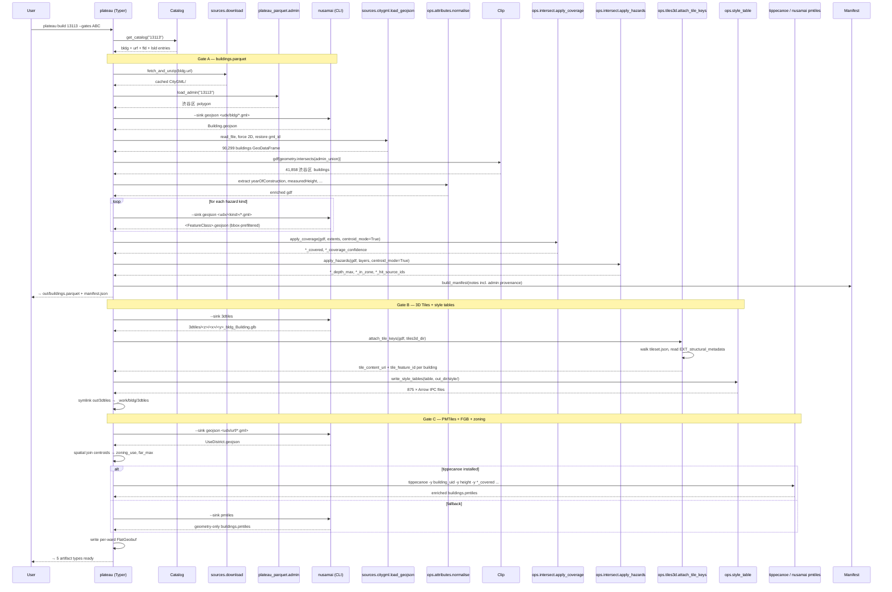

# Pipeline sequence diagram

End-to-end flow for `plateau build CITY --gates ABC`. All stages are idempotent
(cached `_work/` dirs are reused on re-runs).

## Reading the diagram

- **Idempotence**: every `Nusamai` call short-circuits if the target file
  already exists. Re-running ABC after a Gate-A-only build is fast.
- **Centroid mode**: `apply_coverage` and `apply_hazards` default to
  representative-point sjoin (`within` predicate), avoiding the O(N · M)
  polygon-vs-polygon cost on huge cities. See `docs/PERFORMANCE.md`.
- **Honesty invariant**: `apply_coverage` runs *before* `apply_hazards`.
  Buildings outside coverage extent can't acquire a depth value even if
  they happen to sit inside an inundation polygon — encoded as a hard
  filter in the `apply_hazards` loop.
- **Provenance**: `Manifest` records the admin polygon source and the
  CKAN dataset id; downstream consumers reading the parquet can also
  read the manifest to know exactly which PLATEAU release the build came
  from.

## Branching points

| If… | …then |
|---|---|
| User passes `--no-hazards` | `Cov` + `Haz` blocks skipped; parquet ships with `*_covered = false` everywhere |
| User then runs `plateau hazard CITY` | Existing parquet loaded, `Cov` + `Haz` injected in place |
| nusamai's geojson sink emits unexpected feature classes | gate_a logs warning, falls back to first matching `*.geojson` |
| Admin polygon for city not in bundled `japan_admin.geojson` | `load_admin()` returns None, `declared_full_admin` ↓ unknown |
| Hazard sub-bundle missing (e.g. Osaka lsld) | gate_a tolerates and marks unknown |
